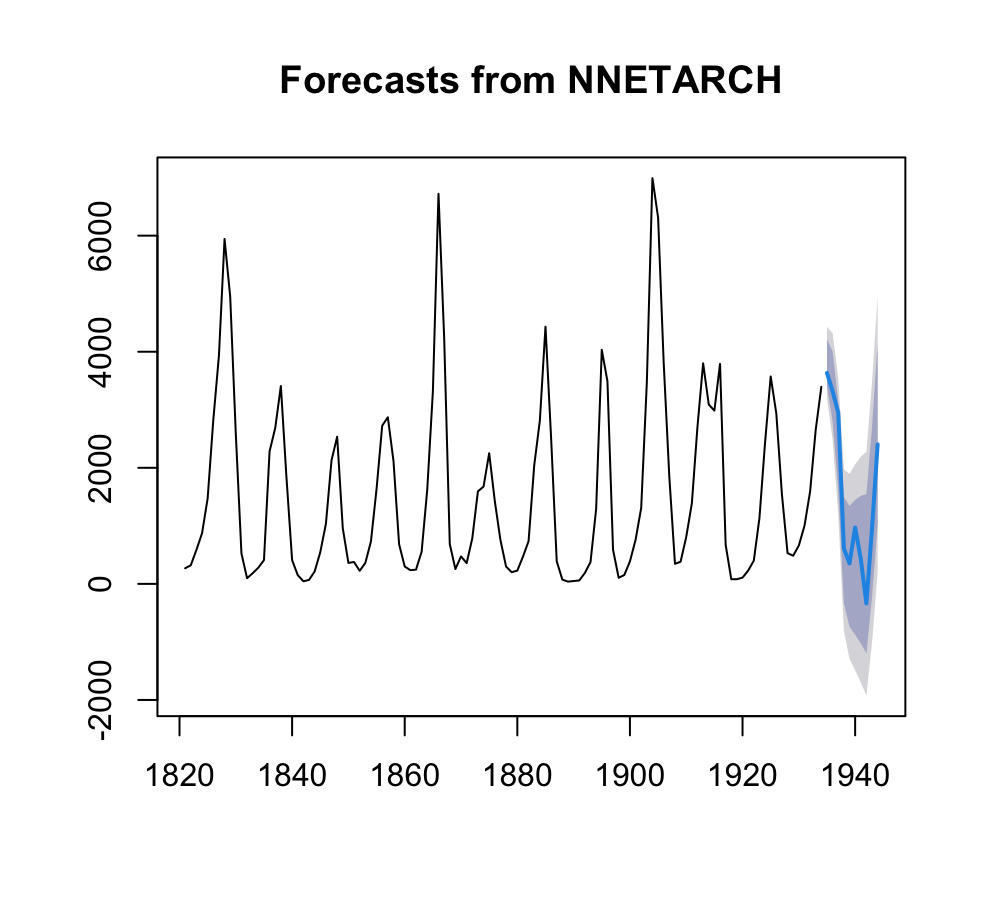

<!-- README.md is generated from README.Rmd. Please edit that file -->

# NNETARCH 

**Neural Network Autoregressive Conditional Heteroskedasticity for Time Series Forecasting**

NNETARCH provides a hybrid forecasting model that combines nonlinear autoregression via neural networks (`nnetar`) with conditional variance modeling (volatility) using either another `nnetar` model or a GARCH(1,1) process.

This extends the `forecast` package to support variance-adaptive models.

------------------------------------------------------------------------

## Installation

Install the development version of NNETARCH from GitHub:

``` r
# install.packages("devtools")
devtools::install_github("rafmontano/NNETARCH")
```

------------------------------------------------------------------------

## Example

``` r
library(forecast)
library(NNETARCH)

fit <- nnetarch(lynx, h = 14)
fct <- forecast(fit)
plot(fct)
```

### Forecast Output



------------------------------------------------------------------------

## The NNETARCH framework - Architecture

The NNETARCH framework combines a trend model and a volatility model into a unified forecasting strategy:


------------------------------------------------------------------------

## Model Description

The NNETARCH model is defined as:

`y_t = f(y_{t-1}, ..., y_{t-p}) + g(e_{t-1}, ..., e_{t-q}) * ε_t`, where `ε_t ~ N(0,1)`

Where:

-   `f(.)`: Neural network for nonlinear trend\
-   `g(.)`: Volatility model (neural network or GARCH)\
-   `ε_t`: White noise innovation

## License

MIT © Rafael Montano, University of Sydney

------------------------------------------------------------------------
