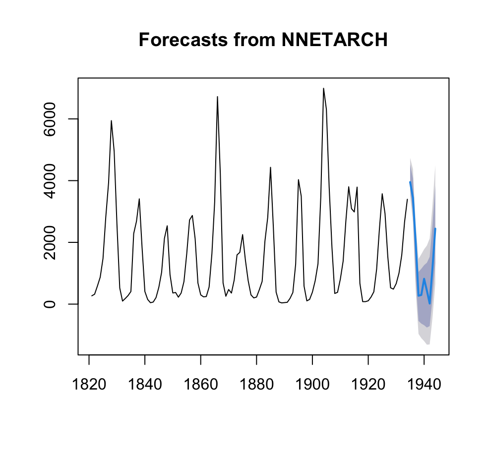
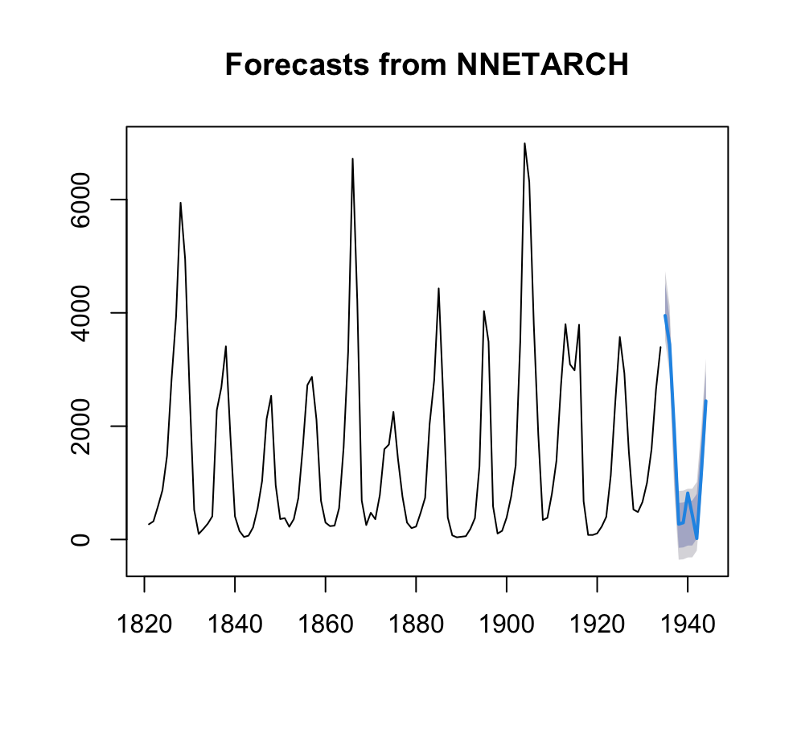
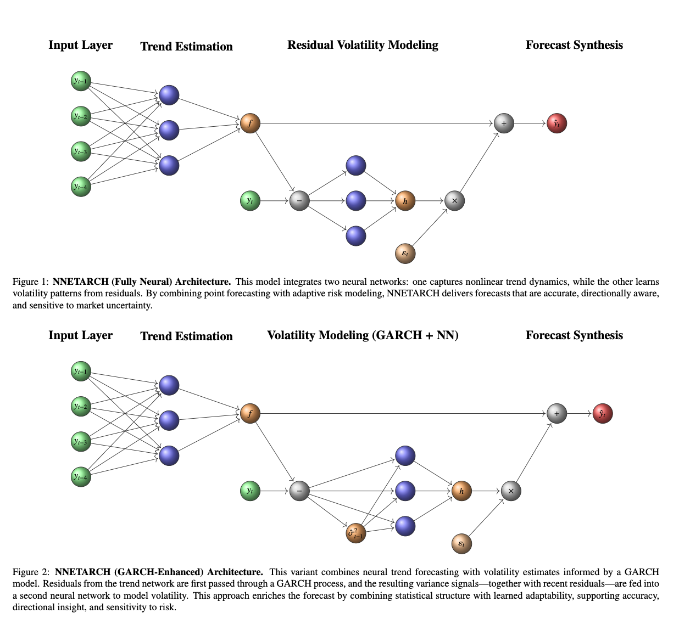

NNETARCH
================

<!-- README.md is generated from README.Rmd. Please edit that file -->

# 

# NNETARCH: Neural Network Autoregressive Conditional Heteroskedasticity for Time Series Forecasting

**NNETARCH** provides a hybrid forecasting framework that enhances both
point forecast accuracy and volatility responsiveness. The model
integrates nonlinear autoregressive learning using neural networks
(`nnetar`) with conditional variance estimation to capture
heteroskedasticity.

The volatility component is modeled in two alternative ways:

- A second neural network trained on lagged residuals or residual
  squares (Model 1).
- A GARCH-informed neural network, where conditional variance estimates
  from a GARCH(1,1) model (via the `rugarch` package) are used as
  additional inputs to a second `nnetar` model (Model 2).

This unified generative approach allows NNETARCH to produce forecasts
that are adaptive to volatility regime shifts and better suited for
financial and macroeconomic time series characterized by clustering and
dynamic risk.

## Confidence Intervals

The `forecast.nnetarch()` method supports two styles of prediction
intervals:

- **Forecast-style intervals** (default): These match the cumulative
  variance approach used in the `forecast` package, where variance
  accumulates over time across the forecast horizon.
- **GARCH-style intervals** (`garch_confint = TRUE`): These use
  conditional standard deviations from the volatility model at each
  step, consistent with ARCH/GARCH volatility modeling frameworks.

The user can toggle between these modes using the `garch_confint`
argument to suit specific applications, including distributional
forecasting and risk quantification.

------------------------------------------------------------------------

## Installation

Install the development version of NNETARCH from GitHub:

``` r
# install.packages("devtools")
devtools::install_github("rafmontano/NNETARCH")
```

------------------------------------------------------------------------

## Example 1

``` r
library(forecast)
library(NNETARCH)

fit <- nnetarch(lynx, h = 14)
fct <- forecast(fit)
plot(fct)
```

### Forecast Output


------------------------------------------------------------------------

## Example 2

``` r
library(forecast)
library(NNETARCH)

fit <- nnetarch(lynx, h = 14, volatility.model = "garch_nnetar")
fct <- forecast(fit) # Default confidence interval style
plot(fct)

# Optionally use GARCH-style confidence intervals
fct_garch <- forecast(fit, garch_confint = TRUE)
plot(fct_garch)
```

### Forecast Output



------------------------------------------------------------------------

## Example 3

``` r
library(forecast)
library(NNETARCH)
library(rugarch)

# Define a custom GARCH(1,1) specification
garch_spec_custom <- list(
  variance.model = list(model = "sGARCH", garchOrder = c(1, 1)),
  mean.model = list(armaOrder = c(0, 0), include.mean = FALSE),
  distribution.model = "std"  # Student-t distribution for heavier tails
)

# Fit the NNETARCH model with the custom GARCH specification
fit_custom <- nnetarch(lynx, h = 14, volatility.model = "garch_nnetar", garch.control = garch_spec_custom)

# Forecast
fct_custom <- forecast(fit_custom)

# Plot
plot(fct_custom)
```

### Forecast Output



------------------------------------------------------------------------

## The NNETARCH framework - Architecture

The NNETARCH Framework - Architecture

The NNETARCH framework is designed to forecast both the nonlinear
conditional mean and the time-varying conditional variance of a
univariate time series using a two-branch neural architecture.

Two variants are supported:

• Model 1 (Fully Neural): Both trend and volatility are modeled using
neural networks. • Model 2 (GARCH-Informed): The trend is modeled with a
neural network; volatility is first estimated via a GARCH(1,1) model and
then passed to a second neural network.



------------------------------------------------------------------------

## Model Description

NNETARCH generates probabilistic forecasts by modeling both the
nonlinear conditional mean and the conditional variance of a time
series.

The generative model is defined as:

$$
y_t = f(\mathbf{y}_{t-p:t-1}) + \exp\left(\frac{1}{2} h(\cdot)\right) \cdot \varepsilon_t, \quad \varepsilon_t \sim \mathcal{N}(0, 1)
$$

Where:  
- $f(\cdot)$: Neural network for the nonlinear trend  
- $h(\cdot)$: Neural network for the log of the conditional variance  
- $\varepsilon_t$: Standard normal innovation

Two configurations are supported: 1. Fully Neural Volatility Model: The
log-variance function $h(\cdot)$ is estimated from lagged residuals
$e_{t-q:t-1}$ using a neural network. This configuration learns
volatility directly from past forecast errors. 2. GARCH-Enhanced Neural
Volatility: The function $h(\cdot)$ is trained on both lagged residuals
and GARCH-estimated conditional variances $\hat{\sigma}^2_{t-r:t-1}$,
leveraging econometric insights while preserving nonlinear learning
capacity.

This hybrid structure enables NNETARCH to adapt both the mean and
variance of forecasts in response to structural shifts and volatility
clustering. The model produces a full predictive distribution, not just
a point forecast—making it suitable for financial decision-making under
uncertainty.

## License

MIT © Rafael Montano, University of Sydney

------------------------------------------------------------------------

## Dedication

This work is dedicated to the memory of **Francisco Jose Avila Fuenmayor
(“Franco”)**,  
who was like a father to me when I needed one most.  
His strength, generosity, and quiet guidance inspired this journey.

------------------------------------------------------------------------
